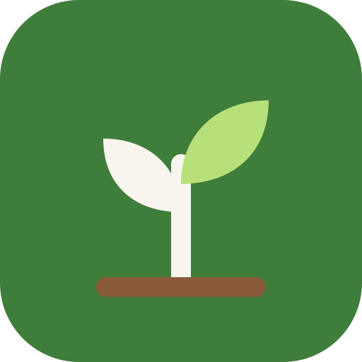
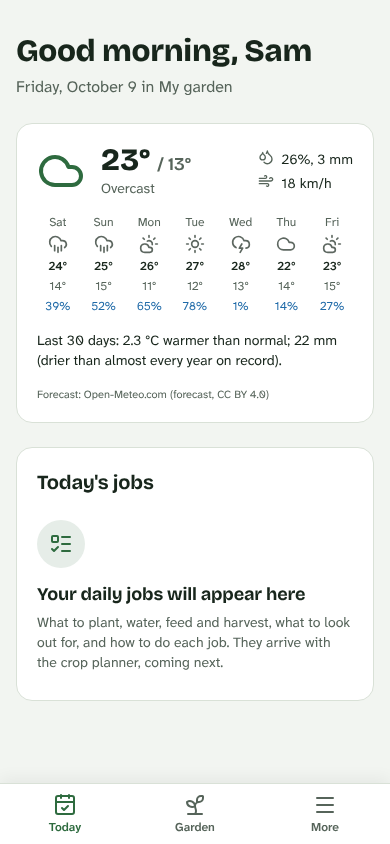
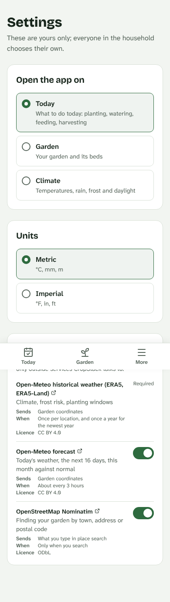
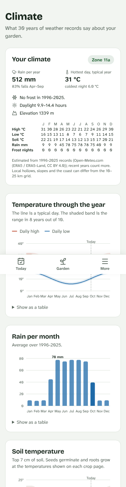
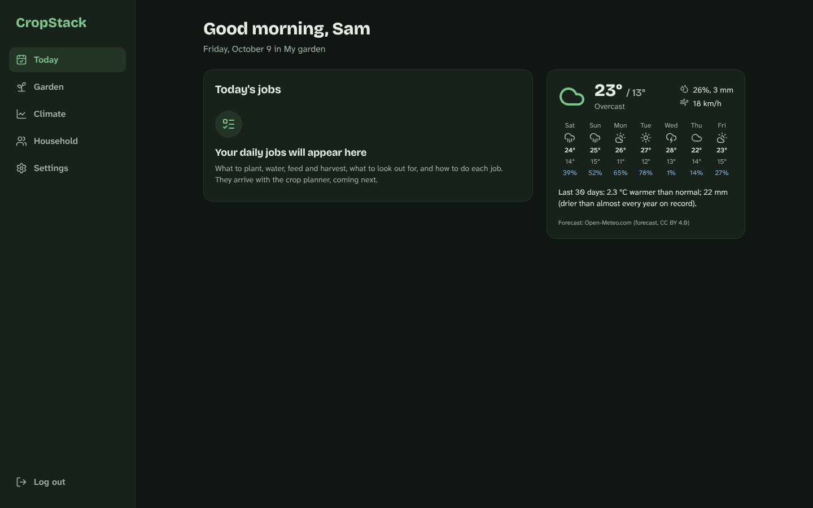
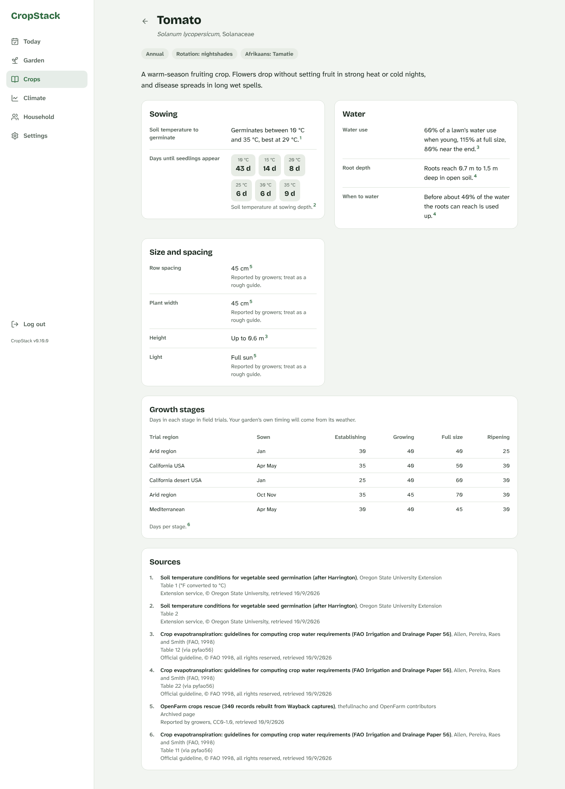
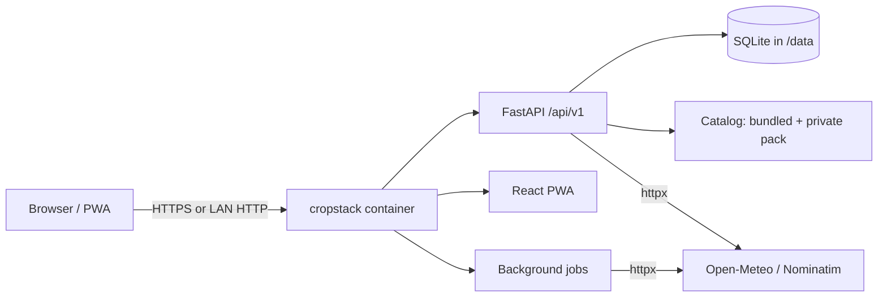

<div align="center">



# CropStack

**From seed to storehouse: a self-hosted garden and homestead planner that works from your own weather.**

[](https://github.com/krugerhomeassistant/CropStack/actions/workflows/ci.yml)
[](https://github.com/krugerhomeassistant/CropStack/releases)
[](https://github.com/krugerhomeassistant/CropStack/pkgs/container/cropstack)

[](LICENSE)
[](catalog/LICENSE)

</div>

---

CropStack tells you **what to do in the garden today, and how**: what to plant, water, feed and harvest, what to look out for, and which animals need what. It works this out from 30 years of your location's weather, this season's actual weather and the forecast, and from what each crop and animal needs. There are no climate presets or regional modes: a winter-rainfall garden in the Western Cape and a frosty one in Minnesota get different advice from the same rules.

It runs on your own hardware (a NAS, a Raspberry Pi, a home server) as one container with one SQLite file. No telemetry, no account with us.

<p align="center">
  
  &nbsp;
  
  &nbsp;
  
</p>
<p align="center">
  
</p>
<p align="center">
  
</p>

> [!NOTE]
> CropStack is in active development (v0.10). The foundations work today: households, your garden's climate and weather, and a first crop catalog. The daily jobs, crop planner and animal care are next. See [what works now](#-what-works-now) and the [roadmap](#-roadmap).

## ✅ What works now

- **Your garden's climate.** Enter a place, postal code or coordinates and CropStack downloads 30 years of daily weather for that spot, then describes it in plain words: rain per year and when it falls, the hottest day and coldest night of a typical year, frost dates if frost happens at your chosen risk level, daylight, and warming or cooling trends. Recent years count more.
- **Today's weather.** Today and the next 7 days, plus how the last 30 days compare with normal ("2.3 °C warmer than normal; drier than almost every year on record"). Refreshed in the background.
- **Climate charts.** The shape of your year at a glance: typical daily highs and lows with their range, rain per month, soil temperature, day length, and the chance of a freezing night if your nights freeze at all. Hover or touch for any day; a table view is one tap away.
- **A probability engine.** Behind the scenes every year on record is treated as a possible future, so CropStack can answer questions like "how likely is soil above 10 °C by this date?" for any threshold. This is what the crop planner will build on.
- **Households.** Share one garden with your family. Owners invite people by link as *member* (does the daily work) or *viewer* (looks only).
- **Your choices.** Each person picks the screen the app opens on and metric or imperial units.
- **Privacy you can see.** Settings lists every outside service CropStack talks to, what it sends and when. Owners can switch off the forecast and place search.
- **Installable app.** Works as a phone app (PWA) in light and dark mode, with a desktop layout for larger screens.
- **When to sow here.** Every crop page works out, from your own climate, the dates you can sow it in the ground and the dates you can set out seedlings started indoors, with the best stretch, days to harvest and the chance of success for each day. Nothing to configure; where a crop can't succeed it says why.
- **Today's jobs.** From your plantings, Today lists what to do now (sow, set out seedlings, start harvesting), each with why now. Mark a job done and the planting moves along; the next two weeks are listed below.
- **Watering.** CropStack tracks the water in the soil for each planting from evaporation, rain and root depth, and tells you when to water and how much, so you water when the crop needs it and not by the calendar.
- **Frost and heat alerts.** If the forecast shows a night too cold or a day too hot for something you have growing, Today lists a Protect job with the figure and the crop's limit.
- **Plantings.** Choose *Plant this* on a window, and the Garden tab keeps track: what, how many, where, and whether it is sown, up, set out, harvesting, finished or failed.
- **Crop catalog.** 29 common vegetables, searchable in English or Afrikaans: when they germinate and how fast at each soil temperature, how much water they use and how deep their roots go, spacing, and growth stages. Every number shows where it comes from and how strong the evidence is; a credits page lists every source and its licence.

## 🗺️ Roadmap

The full product is specified in [docs/SPEC.md](docs/SPEC.md) and broken into steps in [docs/PLAN.md](docs/PLAN.md).

| Next | What you get |
|---|---|
| More catalog | More vegetables and herbs, varieties, fruit, cover crops, pests, beneficial insects and weeds, temperature limits from FAO ECOCROP |
| Crop engine | Growth stages, protected growing, watering from rain and evaporation, feeding and scouting |
| **Today, fuller** | Feeding, animals and what to look out for, each with how and why (Plant, Harvest, Protect and Water jobs are already there) |
| Setup and planning | A short interview (space, water, household, diet, time, budget), a layout editor drawn to scale with sun and shade, and a plan generator |
| Animals | Poultry, goats, sheep, cattle, pigs, rabbits and bees: daily care, feed and water, records, breeding, heat and cold alerts |
| Harvest and pantry | Harvest log, preserving, pantry stock, seed vault |
| Climate explorer | Charts of temperatures, rain, soil, evaporation and daylight through the year |
| Integrations | Home Assistant (sensors in, irrigation out, tasks on your dashboard) and an optional local or cloud AI co-pilot |

## 🚀 Install

Requires Docker with Compose.

```bash
mkdir cropstack && cd cropstack
curl -O https://raw.githubusercontent.com/krugerhomeassistant/CropStack/main/docker-compose.yml
docker compose up -d
```

Open **http://localhost:8430** and create your account (by default only the first account can sign up; invite everyone else from the Household page). Data lives in `./data` next to the compose file; back up that folder.

Update with `docker compose pull && docker compose up -d`. Database upgrades run automatically on start.

<details>
<summary><b>ZimaOS / CasaOS</b></summary>

1. Dashboard → **App Store** → **+** → **Install a customized app** → **Import**.
2. Paste the contents of [`docker-compose.zimaos.yml`](docker-compose.zimaos.yml) (not `docker-compose.yml`) → **Install**.
3. Open `http://<zima-ip>:8430` and create your account.

Data lives in `/DATA/AppData/cropstack`; memory is capped at 256 MB.

To update, open the app's settings in the dashboard and press **Save** without changes; ZimaOS pulls the newest image and recreates the container. If the version shown under More doesn't change, run `docker pull ghcr.io/krugerhomeassistant/cropstack:latest` in a terminal and press **Save** again. Your data is kept.

</details>

<details>
<summary><b>Build from source</b></summary>

```bash
git clone https://github.com/krugerhomeassistant/CropStack.git && cd CropStack
docker compose up -d --build
```

Development setup (backend, frontend, tests) is in [CONTRIBUTING.md](CONTRIBUTING.md).

</details>

## ⚙️ Configuration

All settings are optional environment variables (copy [`.env.example`](.env.example) to `.env`).

| Variable | Default | Purpose |
|---|---|---|
| `CROPSTACK_PORT` | `8430` | Host port |
| `CROPSTACK_SECRET_KEY` | generated in `data/secret.key` | Session signing key |
| `CROPSTACK_SECURE_COOKIES` | `false` | Set `true` when served over HTTPS |
| `CROPSTACK_ALLOW_REGISTRATION` | `auto` | `auto`: only the first account can sign up; `true`: open; `false`: closed (invite links still work) |

`/api/health` reports the status, version and background jobs; the API reference is at `/api/docs`.

## 🔒 Privacy and data sources

CropStack has no telemetry. It talks to three free public services, all listed in the app under Settings → Data sources:

| Feature | Service | What is sent | When |
|---|---|---|---|
| Climate (required) | [Open-Meteo](https://open-meteo.com) historical weather, ERA5 / ERA5-Land (CC BY 4.0) | Garden coordinates | Once per location, then once a year |
| Forecast (can be switched off) | [Open-Meteo](https://open-meteo.com) forecast (CC BY 4.0) | Garden coordinates | About every 3 hours |
| Place search (can be switched off) | [OpenStreetMap Nominatim](https://nominatim.org) (ODbL) | Your search text | Only when you search |

Climate values are estimates for a 10–25 km grid cell; hollows, slopes and the coast can differ.

## 🧭 How it's built



One multi-arch image: Python 3.14 with FastAPI, SQLModel and Alembic serves the API and a React 19 + Tailwind PWA. Details are in [ARCHITECTURE](docs/ARCHITECTURE.md), how things work in the [wiki](docs/WIKI.md), and the visual system in [DESIGN](docs/DESIGN.md).

## 🤝 Contributing

**Know a plant or animal CropStack is missing?** Anyone can add one: see [docs/CONTRIBUTING-CATALOG.md](docs/CONTRIBUTING-CATALOG.md) and the open gaps in [docs/COVERAGE.md](docs/COVERAGE.md). No coding needed for the issue forms.

See [CONTRIBUTING.md](CONTRIBUTING.md) for the development setup, code standards and release process. Please report security issues privately ([SECURITY.md](SECURITY.md)).

## 📄 License

Code: [MIT](LICENSE). The catalog data in [`catalog/`](catalog/) is licensed separately under [CC BY-SA 4.0](catalog/LICENSE), with attribution and extra terms in [`catalog/NOTICE`](catalog/NOTICE). Weather data © Open-Meteo.com (CC BY 4.0); place search © OpenStreetMap contributors.
