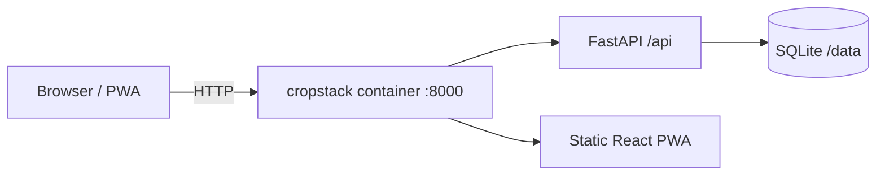

<div align="center">


# CropStack

**From seed to storehouse: automated, location-aware homestead management.**

[](https://github.com/krugerhomeassistant/CropStack/actions/workflows/ci.yml)
[](https://github.com/krugerhomeassistant/CropStack/pkgs/container/cropstack)


[](LICENSE)

[Features](#-features) · [Install](#-install) · [Configuration](#%EF%B8%8F-configuration) · [Status](#-project-status) · [Roadmap](#%EF%B8%8F-roadmap) · [Contributing](#-contributing)

</div>

---

CropStack is an open-source, self-hosted web app that guides gardeners and homesteaders from the first spring seed trays to the full seasonal harvest. It pairs **hyper-local climate data** with a **botanical encyclopedia** so your sowing, transplanting and harvest calendar is worked out for *your* plot, and it runs on **your** hardware: a NAS, a Raspberry Pi or a home server. One container, one SQLite file, no telemetry.

> [!NOTE]
> CropStack is in early development. You can already create an account and set up your garden's location. Features below are the plan; [Project status](#-project-status) shows what works today.

## ✨ Features

### 📍 Location-aware planning
- **Automatic climate setup** from coordinates or postal code: USDA hardiness zone, last spring and first fall frost dates, soil temperatures and daylight curves.
- **Smart calendar & task engine**: a rolling schedule for indoor sowing, hardening off, transplanting, direct sowing, pruning, fertilising, pest checks and harvest windows.
- **Adaptive weather**: heatwaves, surprise frosts and heavy rain shift watering and transplant tasks automatically (public weather APIs or your own station).

### 📚 Botanical encyclopedia
- Care sheets for heirloom and standard fruit, vegetable and herb varieties.
- **When**: sowing depth, germination time, days to maturity, succession intervals.
- **How**: soil pH, sun hours, watering, trellising and a companion-planting matrix.
- **What**: amendments, expected yield per plant or square foot, pest and disease symptoms.

### 🗺️ Garden mapper
- Drag-and-drop beds, rows, containers and food-forest guilds.
- Square-foot overlays with spacing warnings.
- **Crop rotation tracking** that flags soil-depletion and soil-borne disease risks across seasons.

### 🏠 Home Assistant
- Pull soil moisture, light and greenhouse sensors into CropStack (MQTT & REST).
- Drive irrigation valves and greenhouse vents from CropStack's watering schedule.
- Dashboard cards for upcoming tasks and harvest alerts.

### 🤖 AI co-pilot (optional, local-first)
- Photo diagnosis of pests, deficiencies and fungal infections with local vision models (Ollama) or a cloud API.
- Localised questions: *"My tomatoes are yellowing in Zone 7b after three days of rain, what should I top-dress with?"*
- Recipes for canning, freezing and dehydrating based on what's ripening now.

## 🚀 Install

Requires Docker with Compose.

```bash
mkdir cropstack && cd cropstack
curl -O https://raw.githubusercontent.com/krugerhomeassistant/CropStack/main/docker-compose.yml
docker compose up -d
```

Open **http://localhost:8430**. Data lives in `./data` next to the compose file; back up that folder.

Build from source instead:

```bash
git clone https://github.com/krugerhomeassistant/CropStack.git && cd CropStack
docker compose up -d --build
```

Update: `docker compose pull && docker compose up -d`.

### 🧊 ZimaOS / CasaOS

1. Dashboard → **App Store** → **+** → **Install a customized app** → **Import**
2. Paste [`docker-compose.zimaos.yml`](docker-compose.zimaos.yml) → **Install**
3. Open `http://<zima-ip>:8430` and create your account (the first account is the only one that can sign up).

Data lives in `/DATA/AppData/cropstack`; memory is capped at 256 MB.

**Updating:** the app uses the `latest` image, which CI rebuilds on every change to `main`. To update, open the app's settings in the dashboard and press **Save** without changes; ZimaOS re-pulls the image and recreates the container. If it doesn't pick up the new version (check `/api/health`), run `docker pull ghcr.io/krugerhomeassistant/cropstack:latest` in a terminal first, then press **Save** again. Your data in `/DATA/AppData/cropstack` is kept.

## ⚙️ Configuration

All settings are optional environment variables (copy [`.env.example`](.env.example) to `.env`).

| Variable | Default | Purpose |
|---|---|---|
| `CROPSTACK_PORT` | `8430` | Host port |
| `CROPSTACK_SECRET_KEY` | auto-generated in `data/secret.key` | Session signing key |
| `CROPSTACK_SECURE_COOKIES` | `false` | Set `true` behind HTTPS |
| `CROPSTACK_ALLOW_REGISTRATION` | `auto` | `auto` = only the first account can sign up, `true` = open, `false` = closed |

API docs are served at `/api/docs`; `/api/health` reports status and version.

## 📦 Project status

| Area | Status |
|---|---|
| Server, SQLite storage, health check | ✅ v0.1.0 |
| Installable PWA shell (light/dark) | ✅ v0.1.0 |
| Multi-arch Docker image, CI, automatic releases | ✅ v0.1.0 |
| Accounts & garden profile (location, frost-risk preference) | ✅ v0.2.0 |
| Climate setup (zone, frost dates) | 🔜 next |
| Plant encyclopedia & task calendar | 🔜 |
| Garden mapper & rotation | ⏳ |
| Weather adaptation, Home Assistant, AI co-pilot | ⏳ |

The detailed roadmap lives in [docs/PLAN.md](docs/PLAN.md).

## 🛣️ Roadmap

Beyond the core: **pantry & preservation inventory** (canned, cellared, frozen and dried stock with expiry reminders), a **seed vault** (germination tests, year, source) and **livestock & orchard modules** (eggs, hives, pruning cycles, breeding schedules).

## 🧭 How it's built



Single image: Node builds the PWA, Python 3.14 serves it and the API. Details in [docs/ARCHITECTURE.md](docs/ARCHITECTURE.md); concepts and workflows in the [wiki](docs/WIKI.md).

## 🤝 Contributing

See [CONTRIBUTING.md](CONTRIBUTING.md) for the dev setup, code standards and release process. Report security issues privately ([SECURITY.md](SECURITY.md)).

## 📄 License

[MIT](LICENSE)
