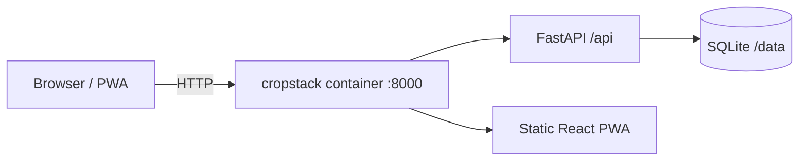

<div align="center">


# CropStack

**From seed to storehouse: automated, location-aware homestead management.**

[](https://github.com/krugerhomeassistant/CropStack/actions/workflows/ci.yml)
[](https://github.com/krugerhomeassistant/CropStack/pkgs/container/cropstack)


[](LICENSE)

[Features](#-features) · [Spec](docs/SPEC.md) · [Plan](docs/PLAN.md) · [Install](#-install) · [Configuration](#%EF%B8%8F-configuration) · [Status](#-project-status) · [Contributing](#-contributing)

</div>

---

CropStack is an open-source, self-hosted homestead app that tells you **what to do today, and how**: what to plant, water, feed and harvest, which animals need what, and which bugs to keep or remove. It works it out from your own space, water, time and goals and from your location's real weather data, and it keeps re-deciding as conditions change. It runs on **your** hardware (a NAS, a Raspberry Pi, a home server): one container, one SQLite file, no telemetry.

> [!NOTE]
> CropStack is in early development. Today you can set up your garden and see its local climate. Everything below is specified in [docs/SPEC.md](docs/SPEC.md) and scheduled in [docs/PLAN.md](docs/PLAN.md); [Project status](#-project-status) shows what works now.

## ✨ Features

### ✅ Today: what to do, how, and why
- One screen with today's jobs grouped as **Protect · Plant · Water · Feed · Harvest · Animals · Check · Maintain**.
- Every job says where, how much and how (depth, spacing, litres, dose), and *why now* in plain words.
- Fits the time you have; the rest moves to the next good day. Works offline in the garden.

### 🧭 Fully dynamic, anywhere
- **No presets, no modes, no regions.** Each crop variety and animal breed has requirements (temperatures, water, daylight, humidity); your location has 30 years of weather, this season's actual weather and a 16-day forecast. Every date and warning comes from comparing the two.
- Frost, heat, drought or humidity appear only when the data says they matter for **what you grow and keep**, and appear by themselves if your climate changes.
- Climate data refreshes itself, weights recent years more and learns from your own sensors and observations (e.g. a frost pocket).

### 🧑‍🌾 Guided setup and a plan that fits
- A short interview: space, sun, water (tanks, restrictions), soil, household size and what you eat, how much you want to grow, time, budget, experience.
- A **plan generator** proposes crops, quantities, successions and animals that fit your space, water and time, shows what is covered each month, and the single change that would help most.

### 🗺️ Layout editor
- Draw your property, beds, containers, structures, trees and buildings to scale; sun and shade hours computed from the sun path and obstacle heights.
- Auto-layout from the plan, spacing and rotation checks, a date slider to see beds through the season, printable bed sheets.

### 🐔 Animals
- Poultry, goats, sheep, cattle, pigs, rabbits and bees: daily care, feeding and water, egg/milk/honey records, breeding planner, heat-stress and cold alerts from the forecast, medication withdrawal periods.

### 🐞 Keep or remove?
- Weekly "what to look for" per crop based on weather and growth stage, with photos, look-alikes and least-harm actions; beneficial insects are flagged as keepers.

### 📦 Harvest, pantry and seeds
- Harvest log with yields, preservation and pantry stock with best-before reminders, seed vault with germination tests and reorder reminders.

### 📈 Climate explorer (for the curious)
- Charts of temperatures, soil temperature, rain, evaporation and daylight through the year, probabilities for any threshold you pick, trends and this season against normal. Kept off the home screen unless you want it there.

### 🏠 Home Assistant & 🤖 AI co-pilot (optional)
- Sensors in, irrigation and ventilation requests out, calendar and to-do entities.
- Local (Ollama) or cloud AI that answers questions from your own garden data and identifies pests from photos.

## 🚀 Install

Requires Docker with Compose.

```bash
mkdir cropstack && cd cropstack
curl -O https://raw.githubusercontent.com/krugerhomeassistant/CropStack/main/docker-compose.yml
docker compose up -d
```

Open **http://localhost:8430**. Data lives in `./data` next to the compose file; back up that folder.

Build from source instead:

```bash
git clone https://github.com/krugerhomeassistant/CropStack.git && cd CropStack
docker compose up -d --build
```

Update: `docker compose pull && docker compose up -d`.

### 🧊 ZimaOS / CasaOS

1. Dashboard → **App Store** → **+** → **Install a customized app** → **Import**
2. Paste [`docker-compose.zimaos.yml`](docker-compose.zimaos.yml) → **Install**
3. Open `http://<zima-ip>:8430` and create your account (the first account is the only one that can sign up).

Data lives in `/DATA/AppData/cropstack`; memory is capped at 256 MB.

**Updating:** the app uses the `latest` image, which CI rebuilds on every change to `main`. To update, open the app's settings in the dashboard and press **Save** without changes; ZimaOS re-pulls the image and recreates the container. If it doesn't pick up the new version (check `/api/health`), run `docker pull ghcr.io/krugerhomeassistant/cropstack:latest` in a terminal first, then press **Save** again. Your data in `/DATA/AppData/cropstack` is kept.

## ⚙️ Configuration

All settings are optional environment variables (copy [`.env.example`](.env.example) to `.env`).

| Variable | Default | Purpose |
|---|---|---|
| `CROPSTACK_PORT` | `8430` | Host port |
| `CROPSTACK_SECRET_KEY` | auto-generated in `data/secret.key` | Session signing key |
| `CROPSTACK_SECURE_COOKIES` | `false` | Set `true` behind HTTPS |
| `CROPSTACK_ALLOW_REGISTRATION` | `auto` | `auto` = only the first account can sign up, `true` = open, `false` = closed |

API docs are served at `/api/docs`; `/api/health` reports status and version.

## 📦 Project status

| Area | Status |
|---|---|
| Server, SQLite storage, health check | ✅ v0.1.0 |
| Installable PWA shell (light/dark) | ✅ v0.1.0 |
| Multi-arch Docker image, CI, automatic releases | ✅ v0.1.0 |
| Accounts & garden profile (location, frost-risk preference) | ✅ v0.2.0 |
| Climate: zone, frost dates, season length, daylight, monthly normals | ✅ v0.3.0 |
| Climate: rainfall pattern, rain and hot days per month | ✅ v0.4.0 |
| Place search (town, address, postal code) | ✅ v0.3.0 |

The specification ([docs/SPEC.md](docs/SPEC.md)) describes the full product; the roadmap ([docs/PLAN.md](docs/PLAN.md)) breaks it into phases:

| Phase | Delivers |
|---|---|
| 3 · Platform | Households & invites (shared with family), per-person start screen, migrations, translations, catalog framework |
| 4 · Environment engine | Probabilistic, self-updating climate + forecast + sensor calibration; removes today's fixed rules |
| 5 · Catalog | 60+ vegetables & herbs, 20 fruits, cover crops, 40 pests/beneficials/weeds, all sourced and editable |
| 6 · Crop engine | Growth-stage model, planting windows, tasks for sowing, care, water, feeding and scouting |
| 7 · Today & calendar | The Today screen, calendars, offline use, notifications |
| 8 · Setup & planning | Guided interview, layout editor with sun mapping, plan generator |
| 9 · Animals | Care, alerts, breeding, production |
| 10 · Harvest & pantry | Harvests, preservation, seed vault, inputs |
| 11 · Climate explorer | Charts and insights |
| 12–13 · Integrations | Home Assistant, AI co-pilot |
| 14 · v1.0 | Afrikaans, accessibility, performance, backups |

## 🧭 How it's built



Single image: Node builds the PWA, Python 3.14 serves it and the API. Details in [docs/ARCHITECTURE.md](docs/ARCHITECTURE.md); concepts and workflows in the [wiki](docs/WIKI.md).

## 🔒 Privacy & data sources

CropStack has no telemetry. Two features talk to free public services:

| Feature | Service | What is sent |
|---|---|---|
| Climate (once per location, then cached) | [Open-Meteo](https://open-meteo.com) historical weather API (ERA5 / ERA5-Land, CC BY 4.0) | Garden coordinates |
| Place search (only when you search) | [OpenStreetMap Nominatim](https://nominatim.org) | Your search text |

Both are used within their free non-commercial terms. Climate values are estimates for a 10–25 km grid cell; frost pockets and slopes can differ.

The crop, pest and animal catalog (format and checks in place; content in progress) is built from openly licensed data and cited facts, with a source and evidence level on every value. See [catalog data sources](docs/research/catalog-data-sources.md).

## 🤝 Contributing

See [CONTRIBUTING.md](CONTRIBUTING.md) for the dev setup, code standards and release process. Report security issues privately ([SECURITY.md](SECURITY.md)).

## 📄 License

Code: [MIT](LICENSE). The catalog data in [`catalog/`](catalog/) is licensed separately under [CC BY-SA 4.0](catalog/LICENSE), with attribution and extra terms in [`catalog/NOTICE`](catalog/NOTICE); the MIT licence does not cover it.
